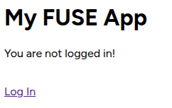
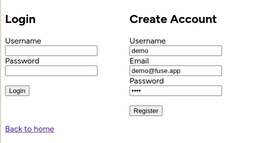
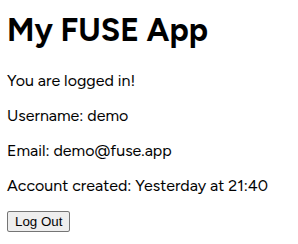
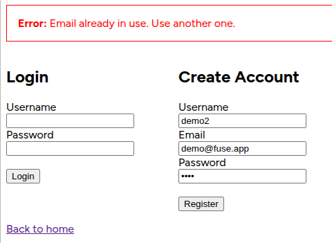

# FUSE Stack

<div align="center">
  
    
  
    
  
    
  
</div>

## Introduction

People love the MERN stack *way* too much.

It's not like I don't get it.

I understand why some people love MERN:

- **MongoDB** is easy to start with, it's flexible, and it doesn't care too much when you don't like thinking hard about schemas.
- **Express** is small, gets out of your way, and lets you build a very simple HTTP server.
- **React** has a massive ecosystem and endless tutorials, so if you get stuck 9/10 times someone has already posted a fix somewhere.
- **Node.js** means you can write JavaScript anywhere, so you have one language across all platforms, and you can also deploy to so many platforms easily.

But people also forget the other side of things.

- **MongoDB**'s flexibility becomes a big liability the moment your data model grows into something more complex.
- **Express** leaves you to manually need to reinvent all sorts of things like structure, error handling, OpenAPI compatibility, SSE, unless you use dozens of external libraries / plugins.
- **React** is, of course, very heavy for most projects. And even excluding that it can become very complex to work with, especially if you want to ensure *performance* or *DX*.
- **Node.js** uses JavaScript which is not type-safe. It is also pretty slow if you have CPU-bound tasks.

This is why I want to introduce the **FUSE** stack.

## Why should I use FUSE?

The **FUSE** stack focuses on two very simple things, but two I believe to be the most important for any developer.

Those two things are **Developer Experience** (DX) and **performance**.

> Don't build APIs. **FUSE** your frontend and backend together.

??? note "Here is an excerpt from the **[FUSE template](https://github.com/uukelele/fuse-template)**'s README:"

    > > Don't build APIs. **FUSE** your frontend and backend together.

    > The **FUSE** stack allows you to combine your frontend and backend together, while not having to think about REST, and still enabling things like realtime messages between client and server for apps like messaging platforms, and autogenerated OpenAPI & REST endpoints matching 1:1 with the RPC endpoints.

    > It's also very performance optimized. It uses **FastAPI**, based on the Starlette framework, using uvicorn as the primary ASGI server for blazing fast performance[^1]. **uv** is written in rust and is **10-100x** faster than pip[^2]. **Svelte** is a precompiled frontend framework with much less bloat compared to React. And, of course, making FUSE possible, is **Ephaptic**. Ephaptic uses Pydantic for validation & serialization (just like FastAPI!) as well as using **msgpack** over JSON and **WebSockets** instead of HTTP, for the lowest possible.

    > If you are worrying about WebSockets breaking compatibility with other clients using your API, don't worry - RPC functions accessible over WebSocket are still accessible, type safe, and are documented in the OpenAPI schema when using HTTP thanks to [The Router](https://ephaptic.github.io/ephaptic/tutorial/router.md).

    > Use the **FUSE** stack if you care about performance without sacrificing DX.

    > [^1]: https://fastapi.tiangolo.com/benchmarks/
    > [^2]: https://github.com/astral-sh/uv/blob/main/BENCHMARKS.md

??? info "These are the components of the **FUSE** stack:"

    |      | Why? | Performance |
    | ---- | ---- | ----- |
    | [**FastAPI**](https://fastapi.tiangolo.com) | It has OpenAPI generation, it uses Pydantic and serializes models which is great for DX, it plays really nicely with **Ephaptic** and **SQLModel**. | Independent TechEmpower benchmarks show **FastAPI** applications running under Uvicorn as [one of the fastest Python frameworks available](https://fastapi.tiangolo.com/#performance), only below Starlette and Uvicorn themselves (used internally by FastAPI). |
    | [**uv**](https://astral.sh/uv) | It supports the modern `pyproject.toml` format, as well as modern best practices, and just has a really clean syntax in the command line. | Written in Rust, and proven to be [10-100x faster than `pip`](https://github.com/astral-sh/uv/blob/main/BENCHMARKS.md). |
    | [**Svelte 5**](https://svelte.dev) | Code written in Svelte is just so much simpler (in my opinion) than React. It's also easier to understand than React (and often results in less hair-pulling, from my experience). | It ships less JS, because it compiles components at build time rather than shipping a virtual DOM. This means faster load times, snappier interactions, and less work for the browser. |
    | [**Ephaptic**](https://ephaptic.github.io) | Ephaptic lets you use a faster WebSocket x msgpack protocol for sending & receiving data to/from the server. This means it also supports bidirectional communication out-of-the box (including *streaming*, great for LLM apps). | Uses Pydantic under the hood, which is written in Rust. Also, WebSocket x msgpack have way lower overhead compared to traditional REST and JSON. If you take a payload using JSON to send a 1MB image in a HTTP POST request, compared to sending a 1MB image in the body of an Ephaptic request, the difference is about 330 KB. Might seem small now but it can add up. And if you compare a simple `{"text": "hi", "number": 220}` between a HTTP POST request and Ephaptic request, it goes from 587 bytes (with HTTP overhead) to *18 bytes* in one WebSocket message. So for your usual simple operation, Ephaptic is **32x** smaller. | 
    | [**Docker**](https://docker.com) | Docker is used as the primary engine holding all the containers together. It makes sense to use in this monorepo structure, and it allows the backend, frontend, database, and gateway to be all isolated yet able to communicate. | Docker containers don't use virtualization. Instead, they are an abstraction on top of the kernel's support for different process namespaces. [Docker containers have nearly identical performance to native, and are faster than KVM in every category.](https://stackoverflow.com/questions/21889053/what-is-the-runtime-performance-cost-of-a-docker-container#26149994) |
    | [**Pydantic**](https://pydantic.dev) | Pydantic is used for you to create your schemas for your data types and to validate them. This helps you have rich type safety even in a language like Python. | Pydantic is written in Rust, and as such has much better performance than pure-python alternatives.
    | [**SQLModel**](https://sqlmodel.tiangolo.com) | SQLModel is similar to SQLAlchemy (it's based on it) BUT it's got built-in support for Pydantic, allowing it to easily integrate with the rest of the stack, like FastAPI and Ephaptic. It makes sure your data always follows the same schema, even in the database. |
    | [**PostgreSQL**](https://www.postgresql.org) | PostgreSQL is a *relational database*. Which is practically *necessary* for modern apps with complex data structures if you want to keep to best practices. | PostgreSQL is exceptionally fast because it has a lot of scalability, extensibility, is compliant with standards, and is very tunable with a high configurability for performance. |
    | [**nginx**](https://nginx.org) | nginx allows the frontend and backend to be hosted on the same domain, which allows you to use (e.g.) `/_ws` as the backend websocket route for both development (so you don't have to have backend on `localhost:8000` and frontend on `localhost:5173`), and in production (so you don't have to have backend on `api.my-fuse.app` and frontend on `my-fuse.app`). | nginx is known for its high performance, capable of handling more than 10,000 simultaneous connections while maintaining a low memory footprint due to its asynchronous event-driven architecture, allowing it to efficiently manage requests. |

## Examples

I can show you some cool examples of the FUSE stack, demonstrating how clean the code can get.

### 1. Complex Data Structures & "Magic" Serialization

One of the biggest headaches in REST APIs is taking a database object (which has hidden fields like password hashes) and converting it to a safe API response. With FUSE, Pydantic handles this recursively and automatically for both HTTP and RPC.

??? info "Recursive Serialization Example"

    ```python title="Backend code (FastAPI + Ephaptic + SQLModel)"
    from sqlmodel import SQLModel, Field
    from typing import List

    class UserBase(SQLModel):
        username: str = Field(min_length=3, max_length=32, unique=True, index=True)
        id: uuid.UUID = Field(default_factory=uuid.uuid4, primary_key=True)
        email: str = Field(unique=True, index=True)

    class UserInDB(UserBase, table=True):
        password_hash: str = Field(max_length=255) # We DON'T want to send this sensitive information to the frontend.
        # So, we store it only in the DB model.

    class UserPublic(UserBase):
        ...
        # We just define this as an empty class, because there is nothing not in UserBase we want to send to the frontend.


    # A complex response containing nested models.
    class TeamResponse(BaseModel):
        team_name: str
        members: List[UserPublic]

    @router.get('/team')
    async def get_team() -> TeamResponse:
        # Fetch raw database objects
        db_user_1 = UserInDB(id=1, username="alice", password_hash="hash1")
        db_user_2 = UserInDB(id=2, username="bob", password_hash="hash2")
        
        # We pass the DB objects directly into the response model.
        # Pydantic will automatically strip the 'password_hash' field 
        # because it doesn't exist in 'UserPublic'!
        return TeamResponse(
            team_name="Engineering",
            members=[db_user_1, db_user_2]
        )
        # So, we can sleep easy knowing that our password hashes aren't leaking!
    ```

    ```typescript title="Frontend with Ephaptic"
    // `team` is automatically type-hinted as a TeamResponse!
    const team = await client.get_team();

    console.log(team.team_name); // "Engineering"
    
    // The members list is fully typed.
    team.members.forEach(member => {
        console.log(member.username); 
        // console.log(member.password_hash); // TypeScript Error! Field does not exist.
        // It won't even error at runtime, it will literally show the error in your editor before you even finish writing :D
    });
    ```

    ```typescript title="Frontend with HTTP (REST)"
    const res = await fetch('/api/team');
    const team = await res.json();

    if (!res.ok) throw new Error(team.error || "Unknown error.");
    
    // NO autocompletion here! You need to guess the types instead :(
    console.log(team.team_name);
    ```

### 2. Streaming AI Responses (Async Generators)

If you are building an AI app, you need to stream tokens to the frontend as they generate, otherwise the user stares at a loading screen for 10 seconds. In FUSE, streaming is just yielding from a function.

??? info "Streaming Example"

    ```python title="Backend code (Streaming)"
    import asyncio
    from typing import AsyncGenerator
    from openai import AsyncOpenAI
    
    client = AsyncOpenAI()

    @router.get('/chat/stream')
    async def stream_ai(prompt: str) -> AsyncGenerator[str, None]: # Synchronous generators work too!
        stream = await client.chat.completions.create(
            model="gpt-5",
            messages=[{"role": "user", "content": prompt}],
            stream=True,
        )
        
        async for chunk in stream:
            if chunk.choices[0].delta.content is not None:
                # Just yield the string. FUSE handles the rest.
                yield chunk.choices[0].delta.content
    ```

    ```typescript title="Frontend with Ephaptic"
    // We get a stream object back instantly
    const stream = await client.stream_ai("What is the capital of France?");

    // Normal async iteration, that you already know how to do.
    for await (const token of stream) {
        // `token` is type-hinted as a string because of the Python return signature!
        document.getElementById('chat').innerHTML += token;
    }
    ```

    ```typescript title="Frontend with HTTP (REST JSONL SSE)"
    // The HTTP fallback is powerful, but requires manual parsing.
    const res = await fetch('/api/chat/stream?prompt=Write a poem about FUSE.');
    // Another issue with using HTTP instead of Ephaptic is that you'd need to manually `encodeURIComponent` the query params (we don't do this now for brevity).
    
    const reader = res.body.getReader();
    const decoder = new TextDecoder();

    while (true) {
        const { value, done } = await reader.read();
        if (done) break;
        
        // FUSE streams pure JSONL for HTTP, so we just split by newline and parse
        const lines = decoder.decode(value).split('\n');
        for (const line of lines) {
            if (line.trim()) {
                const token = JSON.parse(line); // Manual parsing
                // Again, you get no type hinting.
                document.getElementById('chat').innerHTML += token;
            }
        }
    }

    // HTTP has significantly more boilerplate. But it does work.
    ```

### 3. Server-to-Client Broadcasting

What if a long-running background task finishes and needs to alert the user? REST can't do this without clunky long-polling. Ephaptic handles this natively.

??? info "Broadcasting Events"

    ```python title="Backend code"
    from pydantic import BaseModel

    class JobStatusEvent(BaseModel):
        job_id: str
        status: str
        progress: int

    class JobStartResponse(BaseModel):
        started: bool

    @router.post('/jobs/start')
    async def start_job(job_id: str) -> JobStartResponse:
        # We start the job, but we can emit events to specific users instantly
        await ephaptic.emit( # Shorthand for `ephaptic.to(active_user()).emit()`
            JobStatusEvent(job_id=job_id, status="Processing", progress=50)
        )
        return {"started": True} # You are allowed to return dicts here! You don't always *need* to instantiate a model, as long as types match.
    ```

    ```typescript title="Frontend with Ephaptic"
    // TypeScript knows exactly what `event` looks like.
    client.on('JobStatusEvent', (event) => {
        console.log(`Job ${event.job_id} is at ${event.progress}%`);
        document.querySelector('progress').value = event.progress;
    });

    // Start the job
    const { started } = await client.start_job("job_123");
    // Using JS object destructuring! and TypeScript will *still* know that `started` is a bool thanks to the power of Ephaptic!
    ```

### The OpenAPI Bonus

And the best part? Even though you are writing functions optimized for high-speed WebSockets and RPC, **you still receive a complete OpenAPI schema.**

If you navigate to `localhost:4053/api/docs`, you will see a beautiful Swagger UI containing all of your routes, the recursive Pydantic schemas, and the streaming endpoints, fully documented for any third-party developers who want to integrate via standard HTTP.

You write the logic once, and FUSE gives you the best of both worlds.

## How do I use FUSE?

Creating a quick start project with the **FUSE** stack is stupidly easy.

First, go to the **[FUSE Template](https://github.com/uukelele/fuse-template)** on GitHub.

Then, find the "Use this template" button on the top right of the page, and click on it.


Select "Create a new repository".

Next, fill in the details of your repository for your new app.

Once you've done this, you're ready to start working.

### Setup

First, clone the repository to your device. Or, use a GitHub Codespace if you prefer to work in the cloud.

After you've done this, all you need to do is run `./setup.sh`. This automatically configures your project for you. It:

- Creates a `.env` file for you based on `.env.example`, and automatically generates a secure JWT private key, which is stored in your `.env` file.

- Runs `npm install` in the frontend, to ensure that you have the required packages locally.

- Runs `uv sync` in the backend, to create a `.venv` to ensure that you have the required packages locally.

- Runs a first-time generation of the TypeScript schema using Ephaptic (so that initial build works).

Now, in a terminal window that you will keep open, run `./watchers.dev.sh`. This starts the ephaptic watcher process which automatically updates your TypeScript schema the moment you update any model or function on the backend.

Now, you're ready to start building in your IDE of choice!

### Running your app (development)

To run your FUSE app in development mode, run `./dev.sh`. This starts the development docker containers.

When you run this, your FUSE app will be running at `localhost:4053`, which is the default port. To change this, you can modify `docker-compose.dev.yml`.

The development docker containers run both the backend and frontend in watch mode, meaning the moment you make any changes in either the frontend or the backend directories, their respective containers reload. For the frontend, this uses Vite's HMR system, and for the backend uvicorn simply restarts the server process.

### Running your app (production)

In production, all you really need to do is just run `docker compose up --build -d`. This builds the containers and runs them detached. By default, it binds to port 80, but you can update it in `docker-compose.yml`.

### Default FUSE Template App

The FUSE stack template comes with a basic demo app, with a simple login / register page (at `/login`) and a simple user info page at the root. User data is stored in the PostgreSQL backend.

Here are some example screenshots:


###### Root page when not logged in.


###### Login page.


###### Redirection to root page, logged in, after registering.


###### Example of an error being thrown by the backend and caught by the frontend, displayed to the user.