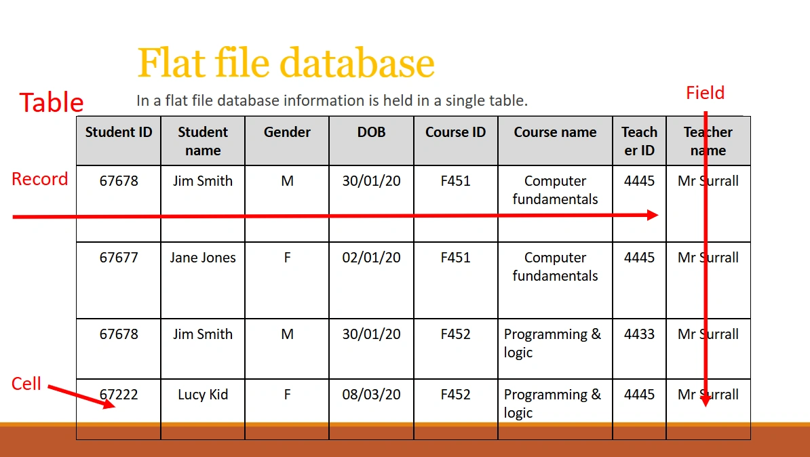

# Flat File Databases

Today, at school, we were going over GCSE content to revise for our <abbr title='Pre-Public Examinations'>PPEs</abbr>.

One of the topics we were studying was SQL.

According to the GCSE specification, we only needed to know flat-file databases, and the three main SQL keywords: `SELECT`, `FROM`, `WHERE`.

But then the teacher showed us *this* abomination of an example of a flat-file database.

Look at this horror.

| Student ID | Student name | Gender | DOB      | Course ID | Course name              | Teacher ID | Teacher name |
|------------|--------------|--------|----------|-----------|--------------------------|------------|--------------|
| 67678      | Jim Smith    | M      | 30/01/20 | F451      | Computer fundamentals    | 4445       | Mr Surrall   |
| 67677      | Jane Jones   | F      | 02/01/20 | F451      | Computer fundamentals    | 4445       | Mr Surrall   |
| 67678      | Jim Smith    | M      | 30/01/20 | F452      | Programming & logic      | 4433       | Mr Surrall   |
| 67222      | Lucy Kid     | F      | 08/03/20 | F452      | Programming & logic      | 4445       | Mr Surrall   |

For those of you who are backend engineers, or have studied a bit more SQL, I'm sure it needs no pointing out the flaws with this design.

But anyway, let me list you the immediate problems I could spot quickly:

- The `Student ID` should be a <abbr title='Primary Key'>PK</abbr>, and named `id`.
- But it can't be a PK, because there are two duplicate rows `67678` for Jim Smith.
    - Because of this, there's a lot of data duplication. The system stores his ID, name, gender, and DOB multiple times.
- The database stores a single course ID and a single teacher ID. Not a problem on its own, if you only allow each student to take one course.
- But then, it also stores the course name and teacher name? They should be using a foreign key for this. But this needs a relational database with multiple tables.
- They also have `Teacher ID` **4445** *and* **4433** corresponding to `Mr Surrall`.
    - Now this might make sense if perhaps the system required each course (e.g. `F451`, `F452` to have different teacher IDs.)
    - But actually, it doesn't, since `Lucy Kid` is also taking `F452` and has teacher `4445`.

And the list goes on and on. The longer you look at it, the worse it gets. I wouldn't even call this a database. More like an Excel spreadsheet from 2005.

Now you might think I'm worrying for no reason. Maybe they're supposed to show this, to show how bad Flat-File databases are, so that they can show us when and where we should switch to a **relational database**! Well, if they did do that, I wouldn't be writing this at all.

They are only teaching us Flat-File Databases in the specification. That means, they are literally showing us this, and saying, **"this is what a flat-file database is supposed to look like"**.

Not many (if any) of my classmates are exactly programmers, so they probably can't spot as many flaws with this.

Also, the teacher gave us a link to learn more independently.

Here it is:

<https://teach-ict.com/2016/GCSE_Computing/OCR_J277/2_2_programming/sql/miniweb/index.php>

A PHP (no hate to PHP by the way, but surely you don't need `index.php` in your URL) site with an article from 2016. Normally this wouldn't bother me. It's just their infuriating amount of ads on the site (school computers don't have adblockers) and the site itself... it isn't really learner friendly. Oh, and it has half of the content behind a <abbr title="A term I made up ten seconds ago. Like a paywall, but with a login page instead.">loginwall</abbr>.

Anyway, don't mind me, but I'm going to glaze [@tiangolo](https://tiangolo.com) <del>again</del> for the first time.

Did I mention? Tiangolo is my idol. Maybe I'll save that for another article.

Anyway, he's the creator of FastAPI and **SQLModel**. And in the SQLModel docs, he wrote a 10,000x better tutorial on databases: <https://sqlmodel.tiangolo.com/databases/>

It has, of course, no ads, no loginwall, a very beginner-friendly structure, it's open-source and written in Markdown with the same engine I use to host this blog, and it's just better at explaining these concepts to a newbie's mind. He also explains with a similar, poorly-designed flat-file database table, **but then he explains why it's bad, and what relational databases are.**

I guess the only downside is that it doesn't adhere to the OCR spec, and teaches more than you'd need to know for GCSE. It is worth it though, if you actually take Computer Science seriously.
