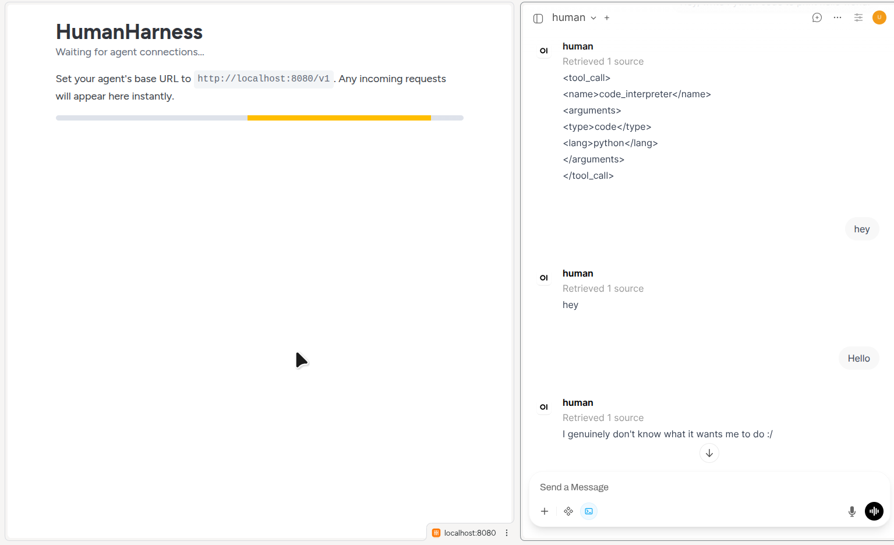
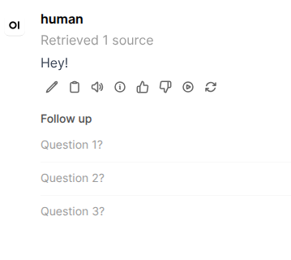
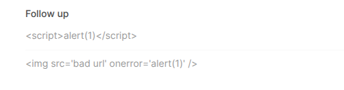
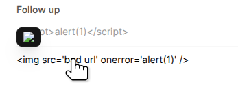
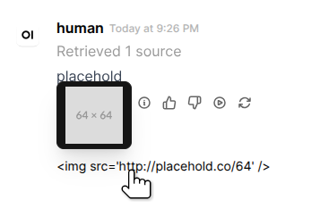
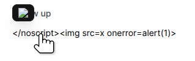
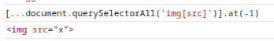
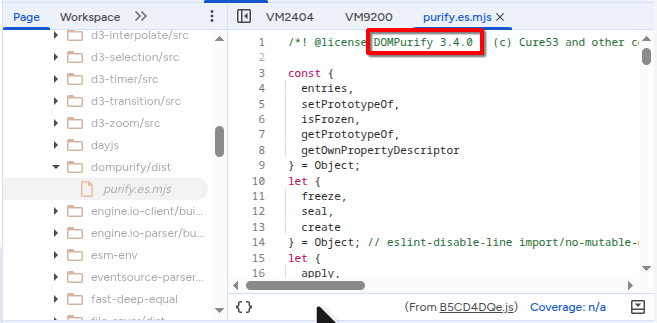

# Open WebUI XSS

Sooo... I was bored recently. So, like any sane bored person, I built something that any sane person would build. *Right!? 😅*

It's called [**Human Harness**](https://github.com/uukelele/HumanHarness), and it's basically a tool that lets any human pretend to be an LLM and enter the world of an AI agent.

You can pretend to be Opus 4.7 running inside of Claude Code, OpenClaw, Pi, Hermes, Codex, or whatever other agentic framework / coding assistant you want!


Anyway, I decided to have a little fun with it, on Open Web UI.



Here it is, wired up to Open Web UI, and me trying to execute tools (Human Harness only supports JSON tool calling right now, not XML!)

From here, I noticed something.

After a response, it would immediately re-request me with this:

> ### Task:
> Suggest 3-5 relevant follow-up questions or prompts that the user might naturally ask next in this conversation as a **user**, based on the chat history, to help continue or deepen the discussion.
> ### Guidelines:
> - Write all follow-up questions from the user’s point of view, directed to the assistant.
> - Make questions concise, clear, and directly related to the discussed topic(s).
> - Only suggest follow-ups that make sense given the chat content and do not repeat what was already covered.
> - If the conversation is very short or not specific, suggest more general (but relevant) follow-ups the user might ask.
> - Use the conversation's primary language; default to English if multilingual.
> - Response must be a JSON object with a "follow_ups" key containing an array of strings, no extra text or formatting.
> ### Output:
> JSON format: { "follow_ups": ["Question 1?", "Question 2?", "Question 3?"] }
> ### Chat History:
> <chat_history>
> ...
> </chat_history>

This was kinda interesting.

At first, I did the usual.

I said `{ "follow_ups": ["Question 1?", "Question 2?", "Question 3?"] }`:



I tried some injection, too:

`{ "follow_ups": ["<script>alert(1)</script>", ""] }`



Looked like it was sanitizing them, too.

I was about to give up, then my mouse accidentally hovered and revealed something!



It turns out, hovering over the follow up actually renders the image!

This means that hovering the follow up content is a way to add arbitrary DOM elements to the tree?

I tried again with a real image url:

`{"follow_ups": [""]}`



This was exciting.

So, I did this to find the DOM element, in the browser console.

First, type `debugger` in the console without pressing enter.
Next, hover over the follow-up (while the console still has focus) and press enter.

This effectively freezes the page so you can move your mouse away and the followup will stay in the DOM.

From there, I ran a simple querySelector query:

`document.querySelectorAll('img[src]')`

That gave me a lot, so I moved to `[...document.querySelectorAll('img[src]')].at(-1)`.

And guess what? That gave me exactly what I wanted, the injected image tag.

So, naturally, I hunted for it in the source code of Open Web UI.

Found the culprit:

[open-webui/src/lib/components/chat/Messages/ResponseMessage/FollowUps.svelte:18](https://github.com/open-webui/open-webui/blob/3660bc00fd807deced3400a63bfa6db47811a3bb/src/lib/components/chat/Messages/ResponseMessage/FollowUps.svelte#L18)

Specifically:

```svelte
{#each followUps as followUp, idx (idx)}
    <Tooltip content={followUp} placement="top-start" className="line-clamp-1">
        <button
            class=" py-1.5 bg-transparent text-left text-sm flex items-center gap-2 text-gray-500 dark:text-gray-400 hover:text-black dark:hover:text-white transition cursor-pointer w-full"
            on:click={() => onClick(followUp)}
            aria-label={$i18n.t('Follow up: {{question}}', { question: followUp })}
        >
            <div class="line-clamp-1">
                {followUp}
            </div>
        </button>
    </Tooltip>

    {#if idx < followUps.length - 1}
        <hr class="border-gray-50 dark:border-gray-850/30" />
    {/if}
{/each}
```

So each followup's raw text content is being passed as the `content` prop into the Tooltip component.

The tooltip component being `$lib/components/common/Tooltip.svelte`.

So, I went and looked there.

[Here](https://github.com/open-webui/open-webui/blob/3660bc00fd807deced3400a63bfa6db47811a3bb/src/lib/components/common/Tooltip.svelte)'s the file, if you're interested.

Immediately, I noticed it was in Svelte 4. Which I'm not exactly good at. But I can still understand it.

I saw this:

```typescript
export let content = `I'm a tooltip!`;
// ...and this...
export let allowHTML = true;
```

If you don't know, these `export let`s are declaring properties (in Svelte 5 this was changed to `$props`, which is a rune).

I noticed that `allowHTML` defaults to true, meaning that by default, ~~unsanitized~~ HTML could pass in through the `content` field!

Well, you might be wondering why I crossed out unsanitized.

Uhh...

I found [this line](https://github.com/open-webui/open-webui/blob/3660bc00fd807deced3400a63bfa6db47811a3bb/src/lib/components/common/Tooltip.svelte#L44):

```typescript
tooltipContent = DOMPurify.sanitize(content);
```

Aw man. Well, it was fun while it lasted. I'm just putting this in `security` anyway with the title "Open Web UI XSS" for no reason at all. Enjoy!

---

...you think I'd give up that easily? Lol, not yet.

So I wwent went to `package-lock.json` and found [this](https://github.com/open-webui/open-webui/blob/3660bc00fd807deced3400a63bfa6db47811a3bb/package-lock.json#L55):

`"dompurify": "^3.2.6",`

Which means `dompurify` is using an older, `3.2.6` version, which is vulnerable to [CVE-2025-15599](https://www.resolvedsecurity.com/vulnerability-catalog/CVE-2025-15599) and [CVE-2026-0540](https://www.resolvedsecurity.com/vulnerability-catalog/CVE-2026-0540)!


Well, I tried a known exploit...

`</noscript>`



...which looked promising...



...but it was still missing the onerror attribute, indicating it'd been successfully sanitized.

So.. I looked in the devtools `Sources` tab under `node_modules`, and found this:



Yeah... 3.4.0

So I looked closer at the `package-lock.json` and found [this](https://github.com/open-webui/open-webui/blob/3660bc00fd807deced3400a63bfa6db47811a3bb/package-lock.json#L7747):

`"version": "3.4.0",`

Yeah so, uh, elsewhere in the `package-lock.json` it'd updated itself to 3.4.0, which (as of now) has no known CVEs.

Now, for real this time, I can't go any further. But this was an incredibly cool learning process, and no doubt real XSS vulnerabilities are found in the same situations as what I'm doing now.

Good luck to anyone else out there hunting!